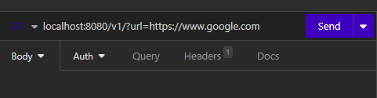
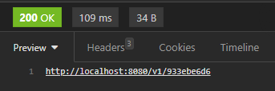

## Url Shortner

### Como utilizar
1. Fazer uma requisição GET com "?url=suaUrl" no endpoint: http://localhost:8080/v1/

2. O Link gerado irá redirecionar para o site colocado na url
   

### How to Use
1. Make a GET request with "?url=yourUrl" to the endpoint: http://localhost:8080/v1/
2. The generated link will redirect to the website specified in the URL
